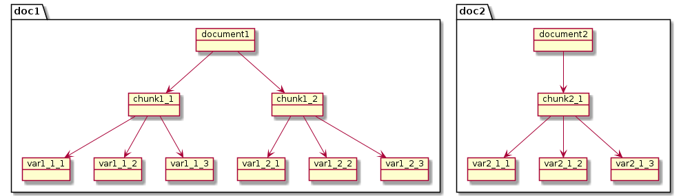
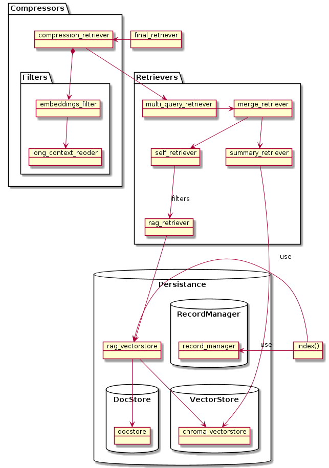

# langchain-rag

[](https://badge.fury.io/py/langchain-rag)
[](https://opensource.org/licenses/Apache-2.0)
[](https://colab.research.google.com/github/pprados/langchain-rag/blob/master/docs/integrations/vectorstores/rag_vectorstore.ipynb)
[](https://codespaces.new/pprados/langchain-rag)

Advanced RAG vector store for LangChain — multi-level document lifecycle management with automatic chunk variation generation for improved retrieval accuracy.

---

## The Problem with Basic RAG

Standard RAG splits documents into chunks, embeds them, and retrieves the top-k closest to a query. This creates two conflicting constraints:

1. **Small chunks** → embeddings are precise, but context is lost
2. **Large chunks** → context is preserved, but embeddings lose meaning

On top of that, in a large corpus the correct answer may be in rank 6 or 7, never reached by a naive top-4 retriever. And re-importing the same document twice silently halves retrieval effectiveness.

## The Solution: `RAGVectorStore`

`RAGVectorStore` solves both problems by maintaining **three levels** of document hierarchy:

```
Original document
    └─ Chunk 1  (stored in docstore, returned by retriever)
    │      └─ Generated question 1  ─┐
    │      └─ Generated question 2   ├─ stored in vector store with embeddings
    │      └─ Summary               ─┘
    │      └─ Original chunk         ─ also stored, as a variation
    └─ Chunk 2
           └─ ...
```



- **Search** is performed over the *variations* (questions, summary, original) — their embeddings are much closer to natural-language queries.
- **Retrieval** returns the *original chunk* — full context preserved.
- **Lifecycle** is managed end-to-end: add, update, or delete a source document and all its chunks and variations follow automatically.

---

## Key Advantages

| Feature | `RAGVectorStore` | Standard vector store |
|---|---|---|
| Retrieval uses semantic variations | ✅ | ❌ |
| Returns full-context chunks | ✅ | ❌ |
| Incremental indexing (dedup) | ✅ via `index()` | ❌ duplicate risk |
| Lifecycle of chunks/variations | ✅ | manual |
| Drop-in LangChain retriever | ✅ | ✅ |
| Works with any vector store | ✅ | ✅ |

---

## Sample

A sample of complex retriever stack built on `RAGVectorStore`:



Layers (innermost to outermost):

1. **`RAGVectorStore`** — stores and retrieves variations, returns parent chunks
2. **`SelfQueryRetriever`** — generates metadata filters from natural-language queries
3. **`MergerRetriever`** — combines chunk and summary retrievers
4. **`MultiQueryRetriever`** — generates multiple query reformulations for better recall
5. **`ContextualCompressionRetriever`** — final reranking and reordering

---

## Three Pipelines

The library is structured around three composable pipelines that operate at different stages.

### 1. Import Pipeline

Triggered when calling `add_documents()` or `index()`. Transforms raw documents into indexed variations:

```
Documents
   │
   ▼ parent_transformer (DocumentTransformerPipeline)
   │   ├─ RecursiveCharacterTextSplitter  ← split on structure (headings, paragraphs)
   │   └─ TokenTextSplitter              ← enforce token budget
   │
   ▼ chunks  (stored in docstore, keyed by chunk_id)
   │
   ▼ chunk_transformer (DocumentTransformers — runs all in parallel per chunk)
       ├─ GenerateQuestionsTransformer  → "What is X?", "How does Y work?"
       ├─ SummarizeTransformer          → "SUMMARY: ..."
       └─ CopyDocumentTransformer       → original chunk text
           │
           ▼ all variations stored in vector store with embeddings
             (metadata carries parent chunk_id for reverse lookup)
```

Each `parent_transformer` and `chunk_transformer` is optional. You can use one, both, or neither — `RAGVectorStore` falls back to storing documents as-is.

### 2. Retriever Pipeline

Triggered on each `invoke(query)`. Layers of retrieval, from inner to outer:

```
query
  │
  ▼ MultiQueryRetriever  ← LLM generates N reformulations of the query
  │   "How do X and Y differ?"
  │   "Explain the contrast between X and Y"
  │   "What distinguishes X from Y?"
  │
  ▼ MergerRetriever  ← fans out to multiple retrievers, deduplicates
  │   ├─ SelfQueryRetriever  ← LLM extracts metadata filter from query
  │   │       │                  e.g. "in document 'History of…'" → filter: title=…
  │   │       ▼ RAGVectorStore (rag_retriever)
  │   │           ├─ searches over variations in vector store
  │   │           └─ returns parent chunks from docstore
  │   │
  │   └─ summary_retriever  ← direct query on vector store, filtered to summaries only
  │           search_kwargs={"filter": {"transformer": "SummarizeTransformer"}}
  │
  ▼ selected chunks (with full context)
```

The key insight: the vector search happens over *variations* (short, semantically focused), but the documents returned are the *parent chunks* (full context).

### 3. Compression Pipeline

Post-processes the selected chunks before injecting them into the prompt:

```
selected chunks
  │
  ▼ DocumentCompressorPipeline  ← applies filters in sequence
  │   ├─ EmbeddingsFilter     ← drops chunks below similarity threshold (optional)
  │   │                          ⚠ disable when using RAGVectorStore: a chunk may
  │   │                            score low while one of its variations scores high
  │   └─ LongContextReorder   ← moves most relevant chunks to edges of context window
  │                              (LLMs attend better to start and end of long context)
  │
  ▼ final_retriever  → inject into prompt
```

The three pipelines compose cleanly — each is independent, and any stage can be replaced or extended:

```python
# Minimal: no transformers, no compression
rag_vectorstore = RAGVectorStore(vectorstore=..., docstore=...)

# Full stack
rag_vectorstore = RAGVectorStore(
    vectorstore=..., docstore=...,
    parent_transformer=...,   # import pipeline stage 1
    chunk_transformer=...,    # import pipeline stage 2
)
final_retriever = ContextualCompressionRetriever(  # compression pipeline
    base_compressor=DocumentCompressorPipeline(transformers=[LongContextReorder()]),
    base_retriever=MultiQueryRetriever.from_llm(   # retriever pipeline
        llm=llm,
        retriever=MergerRetriever(retrievers=[rag_vectorstore.as_retriever(), ...])
    )
)
```

---

## Installation

```bash
pip install langchain-rag
```

Or with `uv`:

```bash
uv add langchain-rag
```

---

## Quick Start

```python
from langchain_openai import OpenAIEmbeddings, OpenAI
from langchain_community.vectorstores import Chroma
from langchain_rag.vectorstores import RAGVectorStore
from langchain_rag.document_transformers import (
    DocumentTransformerPipeline,
    DocumentTransformers,
    GenerateQuestionsTransformer,
    SummarizeTransformer,
    CopyDocumentTransformer,
)
from langchain_text_splitters import RecursiveCharacterTextSplitter

llm = OpenAI(temperature=0)
embeddings = OpenAIEmbeddings()

# Split original documents into chunks
parent_transformer = RecursiveCharacterTextSplitter(chunk_size=700, chunk_overlap=0)

# Generate variations for each chunk
chunk_transformer = DocumentTransformers(
    transformers=[
        GenerateQuestionsTransformer.from_llm(llm),  # generates 3 questions per chunk
        SummarizeTransformer.from_llm(llm),           # generates a summary
        CopyDocumentTransformer(),                    # keeps the original chunk
    ]
)

rag_vectorstore = RAGVectorStore(
    vectorstore=Chroma(embedding_function=embeddings),
    docstore=InMemoryStore(),
    source_id_key="source",
    parent_transformer=parent_transformer,
    chunk_transformer=chunk_transformer,
)

# Add documents — chunks and variations are generated automatically
rag_vectorstore.add_documents(documents)

# Use as a standard retriever
retriever = rag_vectorstore.as_retriever()
chunks = retriever.invoke("What is the difference between pure and applied mathematics?")
```

---

## Lifecycle Management with `index()`

Use LangChain's `index()` to get incremental updates, deduplication, and automatic deletion of stale chunks:

```python
from langchain_classic.indexes import SQLRecordManager, index

record_manager = SQLRecordManager(
    namespace="my_namespace",
    db_url="sqlite:///record_manager.db"
)
record_manager.create_schema()

# First import
result = index(docs_source=documents, cleanup="incremental",
               record_manager=record_manager, vector_store=rag_vectorstore,
               source_id_key="source")
# {'num_added': 5, 'num_updated': 0, 'num_skipped': 0, 'num_deleted': 0}

# Re-import the same documents — all skipped, no duplicates
result = index(docs_source=documents, cleanup="incremental", ...)
# {'num_added': 0, 'num_updated': 0, 'num_skipped': 5, 'num_deleted': 0}

# Only changed documents are re-processed — saves LLM calls
documents[0].page_content += " Updated."
result = index(docs_source=documents, cleanup="incremental", ...)
# {'num_added': 1, 'num_updated': 0, 'num_skipped': 4, 'num_deleted': 1}
```

> Without `index()`, importing the same document twice means the vector store contains it twice — effectively halving the useful top-k.

### Factory helpers

```python
# In-memory persistence (dev/testing)
rag_vectorstore, index_kwargs = RAGVectorStore.from_vs_in_memory(
    vectorstore=chroma_vectorstore,
    parent_transformer=parent_transformer,
    chunk_transformer=chunk_transformer,
    source_id_key="source",
)

# SQL persistence (production)
rag_vectorstore, index_kwargs = RAGVectorStore.from_vs_in_sql(
    vectorstore=chroma_vectorstore,
    parent_transformer=parent_transformer,
    chunk_transformer=chunk_transformer,
    source_id_key="source",
    db_url="sqlite:///record_manager.db",
)

index(docs_source=documents, cleanup="incremental", **index_kwargs)
```

---

## Document Transformers

`RAGVectorStore` ships with composable transformers:

| Transformer | Description |
|---|---|
| `GenerateQuestionsTransformer` | Uses an LLM to generate N questions answered by the chunk |
| `SummarizeTransformer` | Uses an LLM to produce a concise summary |
| `CopyDocumentTransformer` | Passes the chunk through unchanged |
| `SummarizeAndQuestionsTransformer` | Combines summary + questions in a single LLM call |
| `DocumentTransformerPipeline` | Chains transformers sequentially |
| `DocumentTransformers` | Runs multiple transformers in parallel and concatenates results |

### Pipeline example

```python
from langchain_rag.document_transformers import DocumentTransformerPipeline

# First split by wiki sections, then by token count
parent_transformer = DocumentTransformerPipeline(
    transformers=[
        RecursiveCharacterTextSplitter(separators=[r"={1,6} .* ={1,6}", "\n\n"],
                                       is_separator_regex=True),
        TokenTextSplitter(chunk_size=700),
    ]
)
```

---

## Advanced Retrievers

`RAGVectorStore` implements the full LangChain `VectorStore` interface and is compatible with all retrievers:

```python
from langchain_classic.retrievers.self_query.base import SelfQueryRetriever
from langchain_classic.retrievers.multi_query import MultiQueryRetriever
from langchain_classic.retrievers.merger_retriever import MergerRetriever
from langchain_classic.retrievers import ContextualCompressionRetriever
from langchain_classic.retrievers.document_compressors import DocumentCompressorPipeline
from langchain_community.document_transformers import LongContextReorder

# Filter by metadata using natural language
self_retriever = SelfQueryRetriever.from_llm(llm, rag_vectorstore,
                                              "Documents about mathematics",
                                              metadata_field_info)

# Retrieve only summaries from the underlying vector store
summary_retriever = chroma_vectorstore.as_retriever(
    search_kwargs={"filter": {"transformer": {"$eq": "SummarizeTransformer"}}}
)

# Combine retrievers
merge_retriever = MergerRetriever(retrievers=[self_retriever, summary_retriever])

# Generate multiple query reformulations for better recall
multi_query_retriever = MultiQueryRetriever.from_llm(llm=llm, retriever=merge_retriever)

# Final compression and reordering
compressor = DocumentCompressorPipeline(transformers=[LongContextReorder()])
final_retriever = ContextualCompressionRetriever(
    base_compressor=compressor, base_retriever=multi_query_retriever
)
```

---

## Interactive Demo

Try the full end-to-end example on Wikipedia documents directly in your browser:

[](https://colab.research.google.com/github/pprados/langchain-rag/blob/master/docs/integrations/vectorstores/rag_vectorstore.ipynb)

The notebook covers:
- Loading Wikipedia documents
- Configuring transformers (questions, summary, copy)
- Building and querying `RAGVectorStore`
- Incremental indexing with `SQLRecordManager`
- Advanced retriever stack (SelfQuery + Merger + MultiQuery + Compression)
- Answering questions with `load_qa_chain`

---

## Development

```bash
uv sync
uv run python -m ipykernel install --user --name langchain-rag
```

---

## References

- [Why Your RAG Is Not Reliable in a Production Environment](https://towardsdatascience.com/why-your-rag-is-not-reliable-in-a-production-environment-9e6a73b3eddb)
- [Forget RAG, the Future is RAG-Fusion](https://towardsdatascience.com/forget-rag-the-future-is-rag-fusion-1147298d8ad1)
- [Advanced RAG Techniques: an Illustrated Overview](https://pub.towardsai.net/advanced-rag-techniques-an-illustrated-overview-04d193d8fec6)
- [How Chunk Sizes Affect Semantic Retrieval Results](https://ai.plainenglish.io/investigating-chunk-size-on-semantic-results-b465867d8ca1)
- [LangChain pull request #7278](https://github.com/langchain-ai/langchain/pull/7278)
